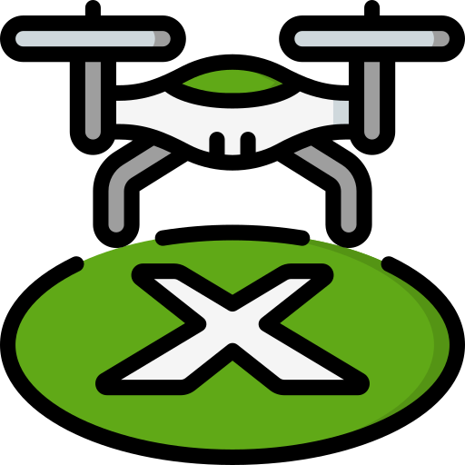
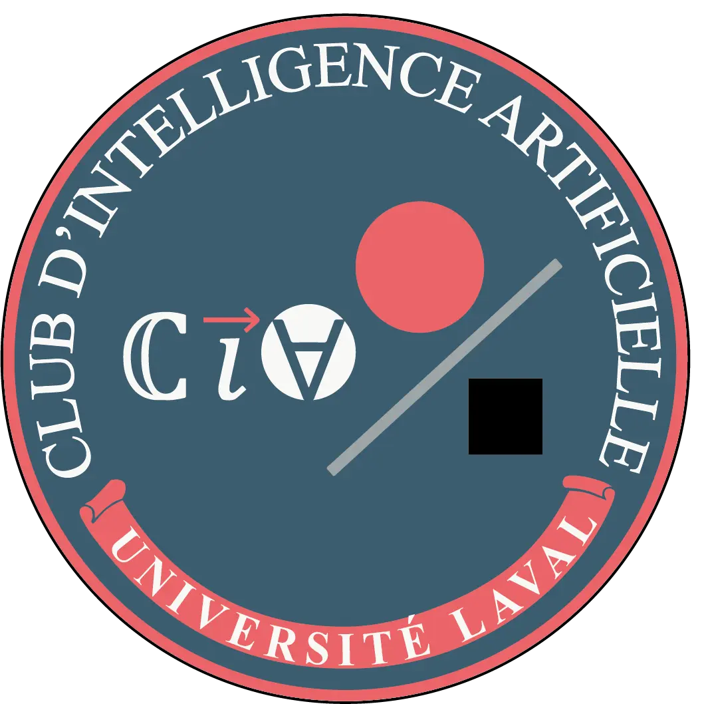

[![Made with Python][python-shield]][python-url]
[![Built with Poetry][poetry-shield]][poetry-url]
[![Made for Raspberry Pi][rpi-shield]][rpi-url]

  

  <h1 align="center">
    AvionCargo $\color{#4db7ff}{\text{AUTOLANDER}}$
  </h1>

**AUTOLANDER** est un projet de vision numérique embarquée visant à faciliter l’atterrissage de précision pour drones
à l’aide de tags ArUco et d’une caméra sur **Raspberry Pi**.  

Le logiciel détecte la cible, estime sa position et la transmet au contrôleur de vol via MAVLink.
Il diffuse également la vidéo et la télémétrie dans un navigateur.

## Documentation

Consultez le **[wiki du projet](https://github.com/cia-ulaval/avion-cargo/wiki)** pour l’installation,
la calibration de la caméra, les essais en simulation, l’utilisation sur Raspberry Pi et la configuration.

Les commandes d’installation, d’exécution, de gestion des dépendances, de formatage et de tests sont regroupées dans
**[Commandes pour développeurs](https://github.com/cia-ulaval/avion-cargo/wiki/Commandes-pour-developpeurs)**.

------------------------------------------------------------------------------------------------------------------------

> Équipe Avion Cargo  
>
> Département de génie mécanique et génie industriel  
> Département d'informatique et de génie logiciel  
> Faculté des sciences et de génie  
> Université Laval  
>
> Hiver 2026
> 
------------------------------------------------------------------------------------------------------------------------

  

  
  

<!-- BADGES LINKS -->

[python-shield]: https://img.shields.io/badge/Made%20with-Python-3776AB?style=for-the-badge&logo=python&logoColor=yellow
[python-url]: https://www.python.org/

[poetry-shield]: https://img.shields.io/badge/Built%20with-Poetry-60A5FA?style=for-the-badge&logo=poetry&logoColor=1A2CA3
[poetry-url]: https://python-poetry.org/

[rpi-shield]: https://img.shields.io/badge/Made%20for-Raspberry%20Pi-C51A4A?style=for-the-badge&logo=raspberrypi&logoColor=red
[rpi-url]: https://www.raspberrypi.com/
